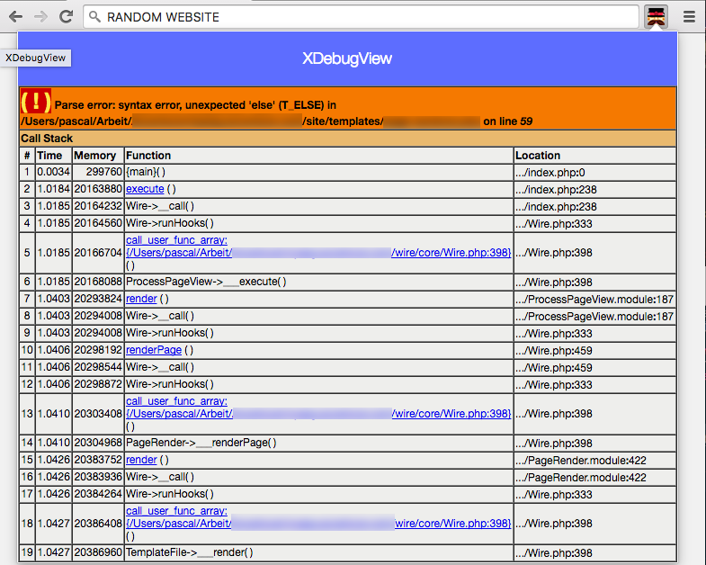

## XDebugView
A chrome extension to view xdebug information in a popup.

I needed this little helper because my xdebug logs were always hidden (due to angular not loading the page when there are PHP errors).


### Screenshot


### Installation

1. Download repo
2. Run `npm install`
3. Run `bower install`
4. Run `gulp package`
5. Install browser extension.

### Contribution
Not needed to be honest.

### License
Licensed under WTFPL

```    
DO WHAT THE FUCK YOU WANT TO PUBLIC LICENSE 
Version 2, December 2004 

Copyright (C) 2004 Sam Hocevar <sam@hocevar.net> 

Everyone is permitted to copy and distribute verbatim or modified 
copies of this license document, and changing it is allowed as long 
as the name is changed. 

DO WHAT THE FUCK YOU WANT TO PUBLIC LICENSE 
TERMS AND CONDITIONS FOR COPYING, DISTRIBUTION AND MODIFICATION 

0. You just DO WHAT THE FUCK YOU WANT TO.
```
